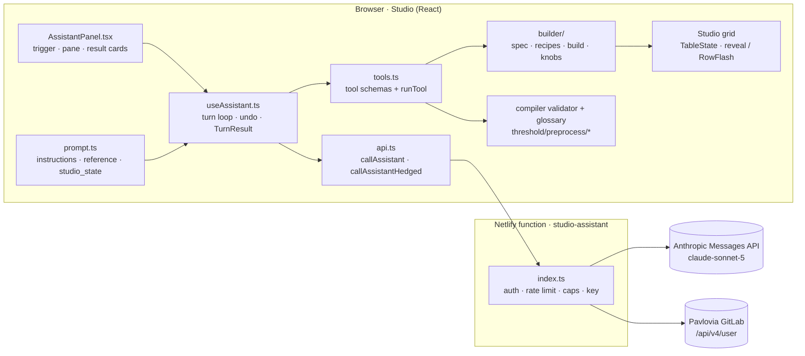
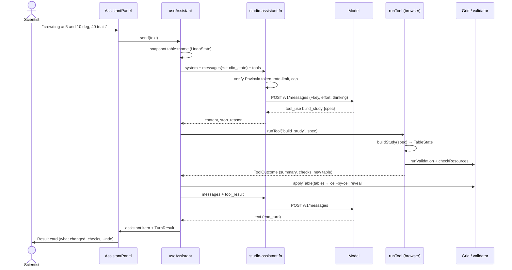

# EasyEyes Assistant — architecture

The assistant is the chat pane in EasyEyes Studio that builds and edits an
experiment table from plain English. This document describes how it is put
together and why; the Studio's own [README](../README.md) covers the editor
it lives in. Code lives in two places:

| Where                                      | What                                                                                |
| ------------------------------------------ | ----------------------------------------------------------------------------------- |
| `docs/experiment/source/studio/assistant/` | The chat UI, the tool definitions and executors, the API client, the prompt         |
| `docs/experiment/source/studio/builder/`   | The Study Builder: spec, recipes, build, knobs — deterministic TypeScript, no model |
| `netlify/functions/studio-assistant/`      | The server relay that holds the API key and guards the model call                   |

Nothing under `threshold/` (the compiler and runtime) changes for the
assistant; it consumes the compiler's validator and glossary as-is.

## 1. Design principle

**The model interprets; deterministic code writes.**

The model never types cells. It reads the scientist's ask and emits a
**compact spec** (~150 tokens: which recipe, which conditions, which
options); the **Study Builder** expands the spec into a complete table in
milliseconds. Edits follow the same pattern: the model picks a **knob** (a
named, deterministic edit) and its arguments; the knob applies the EasyEyes
rules. The compiler's validator runs after every tool call, so the model
sees the verdict on the table before it answers.

The split rests on two properties of EasyEyes:

1. Nearly every study is one of a small number of shapes (crowding, acuity,
   reading, RSVP, color-managed acuity, sound threshold, questionnaire) with
   a handful of parameters that vary. Those shapes are the recipes.
2. The validator says exactly when a table is right, so correctness is
   checked, not hoped for.

What follows from it:

- The model's output is small, so a new study appears in a few seconds and
  an edit takes one round.
- Tables are compile-clean by construction; the checks are a safety net.
- Invented parameters cannot land — every name is checked against the live
  glossary before it reaches the grid.
- Adding a kind of study is one file (a recipe); the prompt, the tool schema
  and the tests pick it up automatically.

## 2. Component map



The browser owns everything that needs the Studio's state: the glossary,
the table, the validator, the tool executors. The function owns only what
the browser must not (the API key) and what it cannot be trusted with (who
may call, how often, how much).

## 3. A turn, end to end



Steps in prose:

1. **Compose.** `useAssistant.send` snapshots the table and experiment name
   (for Undo), appends the scientist's message with a `<studio_state>` block
   (`prompt.ts studioStateBlock`: name, table as csv, current checks, what is
   selected in the grid), and calls the API.
2. **Relay.** The function checks the protocol version, verifies the
   Pavlovia token against GitLab (cached ten minutes), applies rate limits,
   caps the payload, adds the server-side key and model settings, and
   forwards to Anthropic with a 55 s upstream timeout.
3. **Tool round.** For each `tool_use` block in the reply, `runTool`
   (`tools.ts`) executes it in the browser against the current `TableState`,
   validates the result, and returns a `ToolOutcome` — a text summary for
   the model plus a `ToolReport` for the UI. Table-changing outcomes are
   applied to the grid immediately, so the scientist sees the table change
   while the model is still composing its reply.
4. **Loop.** Tool results are appended and the model is called again, up to
   `MAX_TOOL_ROUNDS = 16` rounds per turn. Thinking blocks are passed back
   verbatim as the API requires.
5. **Finish.** The final text and the accumulated `TurnResult` (every tool's
   report, merged) become one assistant item, rendered as a result card with
   an "Undo these changes" button.

Cancel or error truncates the model transcript back to the turn's start, so
the history never holds a `tool_use` without its `tool_result`.

## 4. The Study Builder (`builder/`)

Pure TypeScript, no React, no network. `builder/index.ts` is the public
surface; `studioBuilder.test.js` runs all of it under the real compiler
checks and glossary.

### 4.1 Spec (`spec.ts`)

`StudySpec` is what the model writes. Everything is optional except
`recipe`:

| Field                                                                              | Meaning                                                                                                                                                                                                                                                                                             |
| ---------------------------------------------------------------------------------- | --------------------------------------------------------------------------------------------------------------------------------------------------------------------------------------------------------------------------------------------------------------------------------------------------- |
| `recipe`                                                                           | One of the recipe ids (section 4.2)                                                                                                                                                                                                                                                                 |
| `conditions[]`                                                                     | `ConditionSpec`: position (`eccentricityDeg` + `side`, or `xDeg`/`yDeg`), `trials`, `font`, `durationSec`, `threshold`, `spacingDirection`, `contrast`, sound fields (`soundFolder`, `maskerFolder`, `maskerDBSPL`, `noiseDBSPL`, `task`), an optional `name`, and `set` for any glossary parameter |
| `blocks`                                                                           | `interleaved`, `separate`, or an explicit block per condition                                                                                                                                                                                                                                       |
| `questionsBefore` / `questionsAfter`                                               | `QuestionSpec[]` → `questionAndAnswer@@` blocks                                                                                                                                                                                                                                                     |
| `calibration`                                                                      | screen size, distance (`DistanceMethod`, default `paper`), tracking, gaze, sound                                                                                                                                                                                                                    |
| `forms`, `language`, `viewingDistanceCm`, `participantId`, `recruitment`, `about`  | experiment-wide                                                                                                                                                                                                                                                                                     |
| `colorSpace`, `highPrecision`, `measurePrecision`, `colorimeter`, `backgroundGray` | display / color management, valid on every recipe                                                                                                                                                                                                                                                   |
| `soundCalibration`, `soundOutput`                                                  | sound                                                                                                                                                                                                                                                                                               |
| `set`                                                                              | escape hatch: any experiment-wide glossary parameter                                                                                                                                                                                                                                                |

`STUDY_SCHEMA` / `CONDITION_SCHEMA` / `QUESTION_SCHEMA` are the JSON Schema
the `build_study` tool declares as its input, so a malformed spec is
refused by the API before it reaches the builder. `SPEC_REFERENCE` is the
same information as prose for the prompt. The file also holds the geometry
helpers every recipe shares: `resolvePosition` (side + eccentricity → x, y),
`sideOf`, `positionTag` ("5deg right", "fovea"), and
`legalSpacingDirection` (radial/tangential are undefined at the fovea, so a
foveal target gets horizontal).

### 4.2 Recipes (`recipes/`)

A recipe is one kind of study: a fixed, known-good parameter set plus the
few things that vary per condition. Registered in `recipes/index.ts`:

| id                 | What it builds                                                                           | Modeled on                  |
| ------------------ | ---------------------------------------------------------------------------------------- | --------------------------- |
| `letter-crowding`  | Sloan letter with flankers, QUEST on `spacingDeg`, Bouma-based guess                     | RsvpAndCrowding             |
| `letter-acuity`    | Single letter, QUEST on `targetSizeDeg`                                                  | AcuityNearAndFar            |
| `repeated-letters` | Repeated-letter crowding                                                                 | RsvpAndCrowding             |
| `reading`          | Ordinary reading with corpus and comprehension                                           | readingExperiment           |
| `rsvp-reading`     | RSVP reading, QUEST on word duration                                                     | RsvpAndCrowding             |
| `color-management` | Display precision parameters on; letter acuity at fixed low contrasts on mid gray        | glossary + AcuityNearAndFar |
| `sound-threshold`  | Target sound, alone or in a masker, QUEST on `targetSoundDBSPL`, loudspeaker calibration | InformationalMaskingMelody  |
| `questionnaire`    | Question blocks only                                                                     | minimalExperiment           |

The `Recipe` interface (`recipes/types.ts`):

- **For the model:** `id`, `title`, `summary`, `keywords`, `conditionFields`
  (which `ConditionSpec` fields this recipe reads), `notes` (conventions,
  what needs a resource file), `example` (a realistic spec, shown as the
  worked example).
- **For the builder:** `defaults` (study-level), `conditionDefaults`,
  `defaultConditions` (used when the spec names none), `hasTargetPosition`,
  `experiment(spec)` → extra column-B parameters, `condition(c, spec)` →
  the cells that make one condition this kind of study.
- **For the scientist:** `rationale: string[]` — one clause per non-obvious
  choice ("DHKNORSVZ is the Sloan letter set"). The builder puts it in the
  summary so the assistant can explain the table, not just produce it.

**House rule.** A recipe is the _ideal_ parameter set for its kind of
study, not a bare minimum and not an invention. Every value is taken from a
bundled example study (`threshold/examples/tables`) or is a glossary
default written out because a scientist expects to see and tweak it
(trials, duration, spacing ratio, flanker direction). Values rarely touched
(QUEST beta/delta, response modes) are left to the glossary.
`_calibrateDistance` is always written, `paper` unless the spec says
otherwise.

**Adding a recipe** = one file exporting a `Recipe` + one line in
`recipes/index.ts`. The prompt's reference block, the `build_study` tool
description and the test that compiles every recipe pick it up with no
other change.

### 4.3 Build (`build.ts`)

`buildStudy(input: unknown): BuildResult | BuildFailure`:

1. Validate and normalize the spec; merge recipe defaults.
2. Resolve each condition's position; derive a name if none was given
   (`autoName`: label + position + contrast/masker/task where relevant, so
   two conditions never collide).
3. Assign blocks (`interleaved` = one block, `separate` = one per
   condition, or explicit).
4. Write experiment-wide rows: calibration (`_calibrateScreenSizeBool`,
   `_calibrateDistance`, tracking…), display (`displayParams`: color space,
   float16, dither, precision test — with the compiler's rule that a
   precision test requires `_screenFloat16Bool TRUE`), sound, forms,
   language, recruitment, `_about`. Experiment-wide values collapse to one
   column-B row.
5. Append `questionsBefore` / `questionsAfter` as their own blocks.
6. Infer `fontSource` from the font name (a `.woff2` is a file, otherwise
   Google), sanitize the name.
7. Return `TableState`, a summary that spells out the block structure (so
   the model does not "fix" what is already right), the recipe's rationale
   and a list of resource files the table will need.

### 4.4 Knobs (`knobs.ts`)

The deterministic skills behind `apply_knobs`; one per kind of ask:

`set_eccentricity` `set_trials` `set_blocks` `add_condition`
`remove_condition` `mirror_conditions` `set_font` `set_character_set`
`set_duration` `set_threshold` `set_spacing_direction`
`set_viewing_distance` `set_calibration` `set_display` `set_sound`
`add_questions` `set_forms` `set_participant_id` `set_language`
`set_recruitment` `set_about` `rename_condition` `set_for_all`

A `Knob` declares `id`, `summary`, typed `args` (which `describeKnobs`
renders into the prompt) and `apply(table, args) → KnobResult`. Each knob
owns the EasyEyes rules for its edit:

- Moving a target to the fovea switches `spacingDirection` radial →
  horizontal and re-derives the QUEST guess (`reconcileGuess`).
- Switching a condition's threshold to `spacingDeg` sets
  `spacingRelationToSize` to ratio.
- `set_blocks separate` renumbers blocks.
- `set_display measurePrecision` brings `_screenFloat16Bool` with it;
  `highPrecision false` turns the precision test off.
- `set_sound` writes `needSoundOutput` into every condition, because the
  compiler wants one value per block.

Columns are addressed by letter or condition name. One `apply_knobs` call
carries several knobs, applied in order — structural ones (add / remove /
mirror) first, then values — each seeing the table the previous left.
`set_for_all` covers any glossary parameter no knob owns.

**Adding a knob** = an entry in `KNOBS`. The prompt and the `apply_knobs`
description are generated from it.

## 5. Tools (`assistant/tools.ts`)

`ASSISTANT_TOOLS` is the Anthropic tool-use definition list; `runTool`
executes a call against an `AssistantContext` (table, name, glossary,
resources, grid focus) and returns a `ToolOutcome`.

| Tool                                      | Does                                                                                                                                                                         | Changes table |
| ----------------------------------------- | ---------------------------------------------------------------------------------------------------------------------------------------------------------------------------- | ------------- |
| `build_study`                             | `buildStudy(spec)`; replaces the table and names it                                                                                                                          | yes           |
| `apply_knobs`                             | Runs knobs in order on the current table                                                                                                                                     | yes           |
| `start_from`                              | Loads a bundled example / template / blank                                                                                                                                   | yes           |
| `edit_table`                              | Cell-level fallback (`applyEdits`) for the odd cell no knob covers; parameter names are checked against the glossary and refused with near matches (`similarParameterNames`) | yes           |
| `set_experiment_name`                     | Renames the study                                                                                                                                                            | no            |
| `get_table`                               | Returns the table as csv                                                                                                                                                     | no            |
| `lookup_parameters` / `search_parameters` | Exact / fuzzy lookup over the live glossary                                                                                                                                  | no            |
| `list_resources`                          | EasyEyesResources + files dropped in the Studio                                                                                                                              | no            |
| `ask_user`                                | Ends the turn with a question and option buttons; the scientist's next message is the tool result                                                                            | no            |

**Every table-changing tool validates.** The outcome carries the compiler's
verdict on the resulting table — `runValidation` + `checkResources`, the
same checks the Studio sidebar shows — rendered by `describeChecks`. The
instructions require errors to be fixed before replying. In practice the
builder and knobs produce clean tables, so this is a safety net rather
than a repair loop.

**Build first, ask after.** A study is built with the recipe's defaults and
questions come after the table is on screen, only when the answer cannot be
inferred (a `.woff2` on file, a consent form's exact name).

## 6. Prompt and context (`assistant/prompt.ts`)

`systemBlocks()` returns two system blocks:

1. `INSTRUCTIONS` — short: role, the interpret-don't-type rule, build first
   / ask after, fix errors before replying, how to write a result.
2. `referenceBlock` — the recipes with fields and examples
   (`describeRecipes`), `SPEC_REFERENCE`, the knobs with arguments
   (`describeKnobs`), the template names, and `glossaryIndex`: every glossary
   parameter on one line (type, default, allowed values, first sentence).
   Marked `cache_control: ephemeral` because it is identical turn to turn,
   so it is read from the prompt cache after the first call.

Both are memoized per glossary version (`memoByVersion`), since the
Studio's glossary registry can be re-initialized mid-session.

Per-message context travels in a `<studio_state>` block appended to each
scientist message: experiment name, table as csv, current check results,
and what is selected in the grid (`describeFocus`: "cell fontName in column
D, value Roboto Mono"), which gives "change this cell" a referent.

## 7. Client loop and UI state (`assistant/useAssistant.ts`)

`useAssistant(host)` takes an `AssistantHost` — the Studio's callbacks:
`getContext()` (the live `AssistantContext`: table, name, checks,
resources, grid focus, read at the start of each model call),
`applyTable(table, changedParams, reveal?)`, `applyName`, and
`focusParameter` (result-card chips select a row in the grid). It exposes
`items`, `busy`, `pendingQuestion` (an open `ask_user`), `send`, `cancel`,
`undoTurn`, `reset`.

- **Items.** `ChatItem` is `user` | `assistant` | `question` | `working` |
  `error`. An assistant item can carry `undo: UndoState` and
  `result: TurnResult`.
- **TurnResult.** Each tool's `ToolReport` is folded into the turn's
  running result (`foldReport`): what changed, check status (errors,
  warnings), resources needed — split into missing and unverifiable when
  signed out — and rationale. The panel renders this as a structured result
  card rather than prose.
- **Undo.** `UndoState` holds the table and name from before the turn.
  `undoTurn` restores both, marks the item done, and the next message tells
  the model the changes were reverted.
- **Rounds.** `MAX_TOOL_ROUNDS = 16` per turn. Cancel aborts the in-flight
  fetch and truncates the transcript to the turn start.

## 8. Speed

Where the seconds go, and what keeps them few:

- **Small output.** A spec is ~150 tokens; a knob call is a few dozen. The
  model's output is the dominant latency term. A build round is 2–5 s
  including thinking; a full new study 8–12 s wall clock with its summary;
  an edit 5–8 s.
- **Prompt caching.** The reference block (glossary index included) is
  cached; turns pay only for the conversation and the `studio_state`.
- **Immediate apply.** Table-changing tool outcomes are applied to the grid
  as soon as the round returns, before the model's closing text.
- **Adaptive thinking, hedged.** Server defaults are effort `medium`,
  thinking `adaptive`. The model's thinking time is unbounded and
  occasionally exceeds the function's 60 s wall on an ordinary ask.
  `callAssistantHedged` (`api.ts`) bounds it: if a round has not answered
  after `HEDGE_AFTER_MS = 15 000`, a second request goes out with
  `mode: "fast"` (the function sends effort `low`, thinking `disabled` for
  that call) and whichever reply arrives first is used; the other is
  aborted. Because the tools are deterministic, a thought-free round gives
  an equally usable answer. The hedge is silent in the UI. Errors before it
  fires (sign-in, rate limit, Stop) stay final. Cost: one extra cache-read
  call on slow rounds only.

## 9. The relay (`netlify/functions/studio-assistant/`)

A credentialed relay to the Anthropic Messages API. The browser composes
the whole request (system, messages, tools); the function adds the key and
enforces:

| Guard          | Value                                                                                                                                                                                               |
| -------------- | --------------------------------------------------------------------------------------------------------------------------------------------------------------------------------------------------- |
| Who may call   | A valid Pavlovia sign-in: the token is checked against `gitlab.pavlovia.org/api/v4/user` (5 s timeout, result cached 10 min)                                                                        |
| Origin         | `../shared/cors` allow-list                                                                                                                                                                         |
| Rate limit     | 40 requests / 60 s per client, 30 / 60 s per account (per function instance), plus an edge limit of 120 / 60 s                                                                                      |
| Size           | body ≤ 2 MB, ≤ 200 messages, ≤ 24 tools, ≤ 8 system blocks, `max_tokens` 4096 default / 8192 max                                                                                                    |
| Time           | 55 s upstream timeout inside Netlify's 60 s function limit                                                                                                                                          |
| Model settings | `STUDIO_ASSISTANT_MODEL` (default `claude-sonnet-5`), `_EFFORT` (`medium`; `low`/`high`/`xhigh`/`max`/`off`), `_THINKING` (`adaptive`/`off`). `mode: "fast"` can only lower these, never raise them |

Request: `{ protocolVersion: 1, pavloviaToken, system, messages, tools,
maxTokens?, mode? }`. Response: the upstream message's `content`,
`stop_reason`, `usage`, `model`. Without `ANTHROPIC_API_KEY` the function
answers "not configured" and the pane says so.

The function is legacy-style (`handler(event)`), like the site's other
functions, and is bundled by esbuild from `index.ts`. `dev-server.ts`,
`__tests__/`, `jest.config.js` and the folder's `package.json` are
development-only and are not deployed as functions. Note that Netlify
injects every Functions-scoped environment variable into every legacy
function and AWS Lambda caps that at 4 KB across the whole site; keep the
site's Functions-scoped variables lean.

## 10. UI (`assistant/AssistantPanel.tsx`, `assistant.css`)

- **Trigger.** A 44 px icon-only squircle (`border-radius: 40%`) at the
  bottom right of the Studio with the EasyEyes mark (`EasyEyesLogo.tsx`), a
  thin slowly turning green→teal→blue conic ring (`@property --asst-ring`)
  as the AI cue and a small sparkle badge. The ring speeds up while a turn
  runs. A teaching callout (`NUDGE_ENABLED`) is built but off.
- **Pane.** A full-height side pane along the right edge, width draggable.
  Header with title; a focus strip showing the last grid click (row, or
  `Column D · fontName` with its value); the conversation; three example
  prompts for a new scientist, ordered short → detailed; the composer.
- **Result cards.** An assistant turn that changed the table renders its
  `TurnResult` as a card: what was built or changed, checks status,
  resources needed, rationale, and Undo. `RichText.tsx` styles parameter
  names and backticked terms as code so they read as identifiers.
- **Grid feedback.** A built study reveals cell by cell down and across
  (`reveal` in `components/Grid.tsx`, staggered by row and column, capped
  so long tables finish in about a second); an edit lights the touched rows
  in a wave (`RowFlash`) and scrolls to the first.

All styles are scoped under `.ee-studio`; the assistant's under
`.asst-*`.

## 11. Tests

| Suite                                           | Covers                                                                                                                                                                                                                                                                                     |
| ----------------------------------------------- | ------------------------------------------------------------------------------------------------------------------------------------------------------------------------------------------------------------------------------------------------------------------------------------------ |
| `source/__tests__/studioBuilder.test.js`        | Every recipe, spec variant and knob compiles clean under the real validator and glossary; knob rules (fovea → horizontal, precision → float16, `needSoundOutput` block-wide, renumbering, mirror)                                                                                          |
| `source/__tests__/studioAssistant.test.js`      | Tool executors (`runTool`, `applyEdits`, `build_study`, `apply_knobs`, glossary refusal with near matches), prompt blocks and `studio_state`, `RichText`, `callAssistantHedged` (normal alone, slow → hedge, either side wins, timeout covered, errors before the hedge are final)         |
| `netlify/functions/studio-assistant/__tests__/` | Relay with server-side key, effort/thinking settings, `mode: "fast"` never exceeding the site's setting, model and `max_tokens` caps, GitLab sign-in rejection, 503 without a key, CORS and method, malformed requests, account rate limit, upstream error mapping, edge rate-limit config |

Run from `docs/experiment`: `npx jest source/__tests__/studio`; from the
function folder: `npm test`. `npm run check:ts` in each type-checks.

## 12. Configuration and local development

**Production.** Set `ANTHROPIC_API_KEY` in Netlify → Site configuration →
Environment variables (Functions scope). `STUDIO_ASSISTANT_MODEL`,
`_EFFORT`, `_THINKING` are optional; leave them unset to take the defaults.
The key never reaches the browser; the browser only calls the function.

**Local, without the Netlify CLI.** Put `ANTHROPIC_API_KEY=…` in
`website/.env` (gitignored; `.env.example` lists the names). Then:

```
cd website/netlify/functions/studio-assistant && npm install && npm run dev
```

hosts just this function on `:8888`, the port `easyeyesBaseUrl.ts` probes
when the page itself is on `localhost`. In another terminal run the compiler
dev server as usual (`docs/experiment`: `npm start`), open
`http://localhost:5500/compiler/studio`, sign in on the Compiler tab, open
the assistant. The dev server logs tokens in/out per call and tags hedged
calls `[fast]`. A production page never probes localhost: the base URL is
`https://easyeyes.app` unless the page's own hostname is `localhost` or a
`--easyeyes.netlify.app` preview.

## 13. Boundaries

- Replies are not streamed; a round is one model call under the function's
  60 s limit, with the hedge bounding slow rounds.
- The rate limiter is per function instance.
- Resource files can be named but not uploaded from the chat.
- The knob set covers the common asks; a cell no knob owns is set through
  `set_for_all` or `edit_table`. An ask that recurs belongs in a knob.
- Recipes derive from the example tables in `threshold/examples/tables`; a
  recipe cites the example it follows in `rationale`.
- The relay is a legacy-style Netlify function (`handler(event)`), which is
  what limits it to non-streaming responses and to Lambda's 4 KB
  environment budget.
